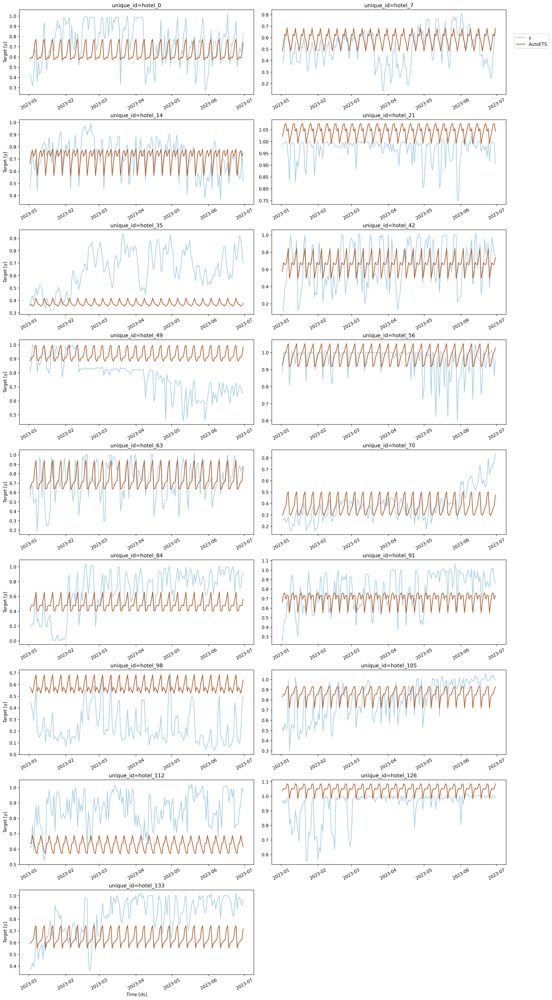

## Hotel Occupancy Forecasting
### ISA 444 Final Project

**Project Purpose:** The goal of this project is to predict hotel occupancy. We are testing multiple types of models on a holdout of the data to see which one performs the best based on MAE. The models used to predict are Naive, Seasonal Naive, ETS, ARIMA, Lightgbm, NBeats, NHits, and TimeGPT.

**Data Description:** The sample of hotel data is for 18 different hotels. The data set includes the unique id for each hotel, date stamp, day, month, year, and percent occupied as a percentage. There are some hotels that when full occupancy is reached, convert conference areas into additional hotel rooms to house more guests, which causes the percent occupancy to surpass 1.0.

### Access Code Here:
[Forecasting Hotel Occupancy Code - Colab](https://colab.research.google.com/drive/1TqV630ISLvYXqVe-2yr-Kqocb5xYx45a#scrollTo=F8vAuFlvRgR8))

[Testing and Evaluation Output CSV](/course_projects/evaluation.csv)

**Evaluation:** Based on an evaluation metric of MAE we found that the best model to predict hotel occupancy was the AutoETS models. This model had an average MAE of .12 or a 12% error since the data is scaled to percentage of occupancy. This is not a great error, it is probably too high to be used in practice.

|                     |   Win Count |   Win Rate |   Average MAE |
|:--------------------|------------:|-----------:|--------------:|
| AutoETS             |           6 |      35.29 |        0.1202 |
| weekly_seasonality  |           4 |      23.53 |        0.1235 |
| TimeGPT             |           3 |      17.65 |        0.124  |
| LGBMRegressor       |           3 |      17.65 |        0.1323 |
| AutoNHITS-median    |           1 |       5.88 |        0.1988 |
| Naive               |           - |          - |        0.1544 |
| monthly_seasonality |           - |          - |        0.1419 |
| AutoARIMA           |           - |          - |        0.1284 |
| AutoNBEATS-median   |           - |          - |        0.1748 |

### Plotting Forecast vs. Actuals Using AutoETS

